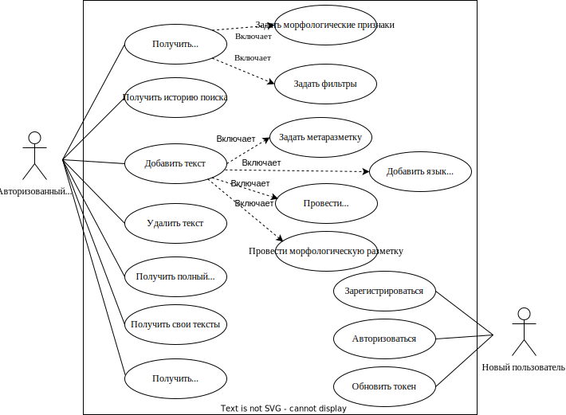
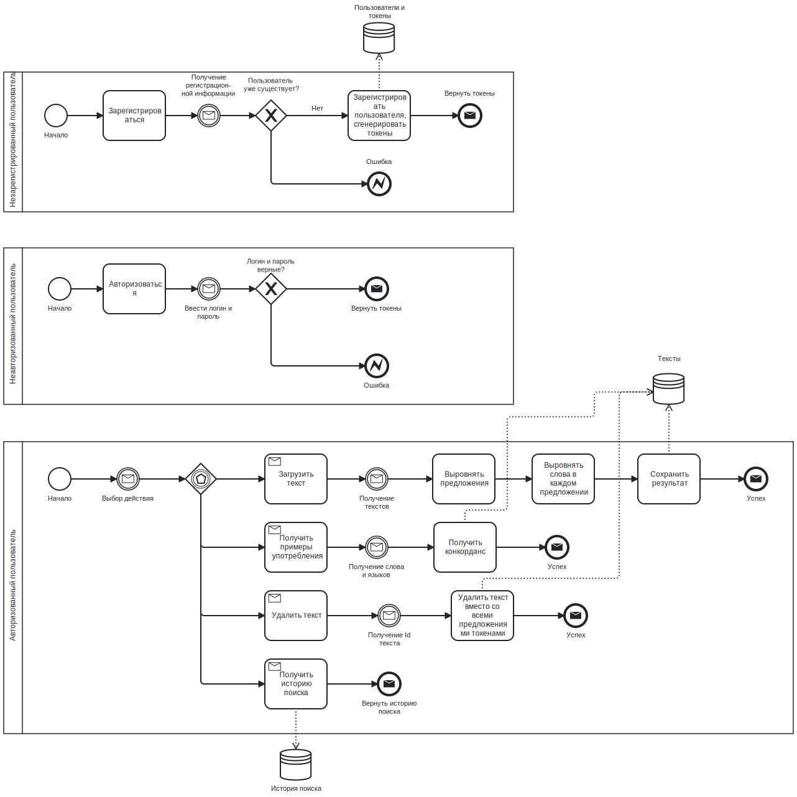

# Parcorpus

Parcorpus - Web API для работы с параллельным корпусом переведенных текстов. С помощью него можно искать переводы слова сразу вместе с примерами употребления.

## Что такое параллельный корпус?

Параллельный корпус – билингвистический корпус, содержащий тексты одновременно как на его изначальном языке, так и на некотором другом языке [[Khosla, 2018](https://www.researchgate.net/publication/327195382_A_SURVEY_REPORT_ON_THE_EXISTING_METHODS_OF_BUILDING_A_PARALLEL_CORPUS)].  

Сегодня параллельный корпус стал неотъемлемой частью процесса перевода. Переводчику необходимы ресурсы, предлагающие ему варианты интерпретации исходного текста для подтверждения собственных гипотез. На практике больше половины времени, затрачиваемого на перевод, уходит на просмотр вспомогательных материалов [[Rura, 2008](https://www.semanticscholar.org/paper/Designing-a-parallel-corpus-as-a-multifunctional-Rura-Vandeweghe/2c7f7cdcb5210fe6a4659edd1892c095eb7f0444)]. Таким образом, использование параллельного корпуса может существенно ускорить работу переводчика.

Вопреки большей части исследований, предлагающих хранить корпус в виде набора XML файлов, данный проект предлагает реализацию параллельного корпуса с использованием реляционной модели данных. 

## Возможности

Разработанная система предоставляет следующие возможности:

- Получение перевода слова и примеров употребления;
- Добавление новых текстов;
- Удаление текстов;
- Навигация по истории поиска;
- Аутентификация и авторизация.

Схематично возможноти системы отражены на диаграмме вариантов использования.

Для использования системы пользователю необходимо зарегистрироваться или, при наличии аккаунта аутентифицироваться. Далее пользователь может исползовать все возможности корпуса: получать переводы и примеры употребления (конкорданс), добавлять новые тексты и управлять ими.

## Формализация

При формализации задачи были выделены такие сущности, как "Текст", "Предложение", "Токен" и др. Диаграмма "сущность-связь" показывает связи между выделенными сущностями.

На основе выделенных сущностей и их связей была разработанна диаграмма базы данных.

Спроектированное ПО представляет из себя набор компонентов. При проектировании системы использовался подход "чистой" архитектуры.

